# 🧭 Jobquest AI

[](https://github.com/yourusername/jobquest-ai/actions)
[](https://codecov.io/gh/yourusername/jobquest-ai)
[](https://opensource.org/licenses/MIT)
[](https://www.npmjs.com/package/jobquest-ai)

Jobquest AI is an intelligent career co-pilot designed to accelerate your job search by leveraging AI-powered job filtering, unified application tracking, resume optimization, and automated calendar reminders. Built with modern web technologies, Jobquest AI helps job seekers focus on acing interviews while automating the tedious parts of the job hunt.

---

## ✨ Features

- 🤖 **AI-Powered Job Filtering:** Uses advanced AI to analyze job listings, filter out spam, and surface genuine hiring posts tailored to your profile.
- 📋 **Unified Application Tracking:** Manage your entire job application pipeline from saved jobs to offers, with notes and reminders.
- 📄 **Resume & ATS Optimization:** Upload multiple resume versions and get ATS scoring to optimize your chances.
- ✉️ **One-Click Application-Based Cover Letters:** Generate tailored cover letters instantly based on job applications.
- 📅 **Automated Calendar & Reminders:** Automatically schedule interviews and follow-ups with integrated calendar and reminder support.
- 📊 **Dashboard Analytics:** Visualize your job search performance with data-driven insights.
- 🌐 **Multiple AI Providers Supported:** Configure AI providers such as LM Studio, Ollama, and Google Gemini for job filtering and analysis.
- 🔐 **Authentication & User Onboarding:** Secure user authentication with NextAuth and onboarding flows.

---

## 📸 Screenshots / Demo

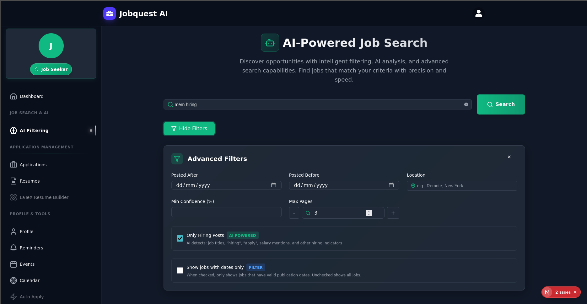
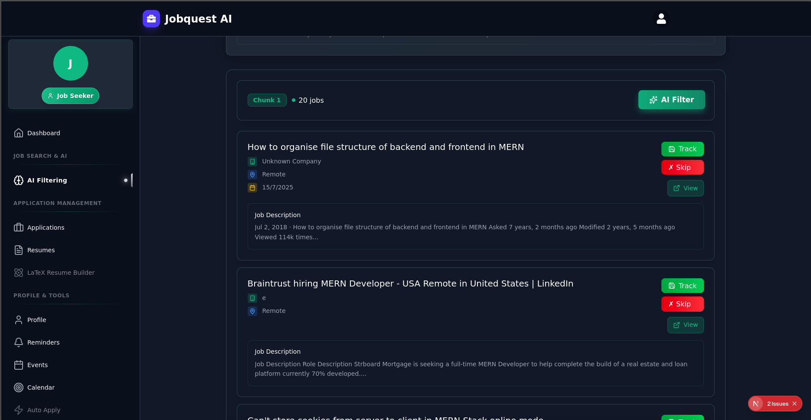
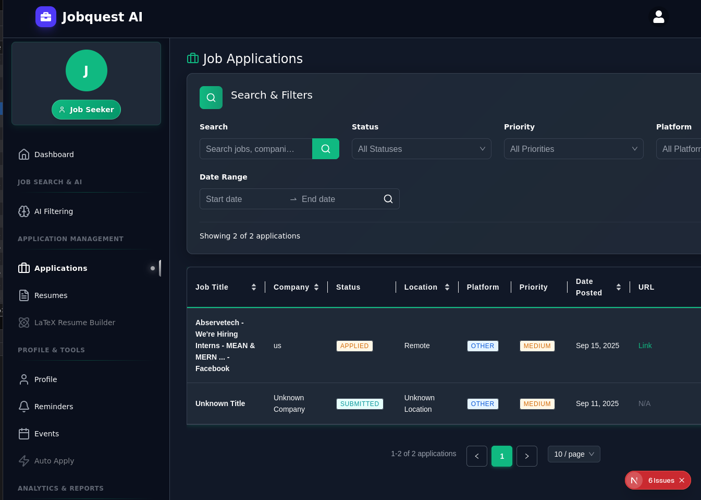
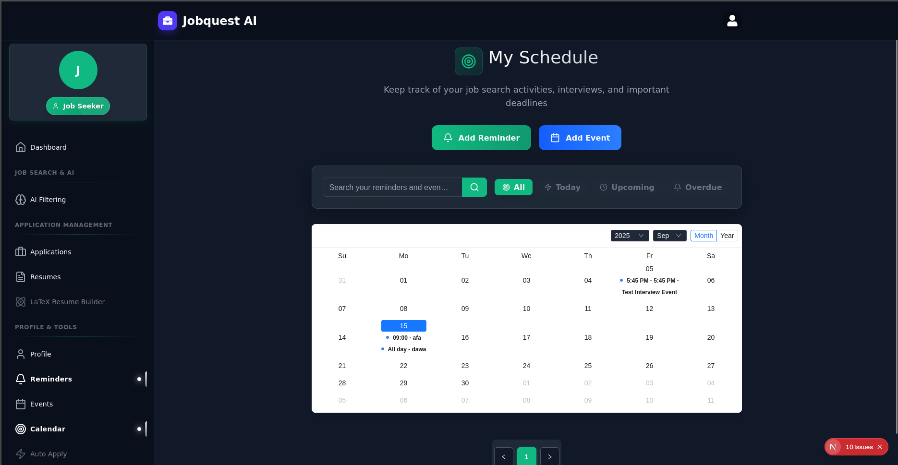
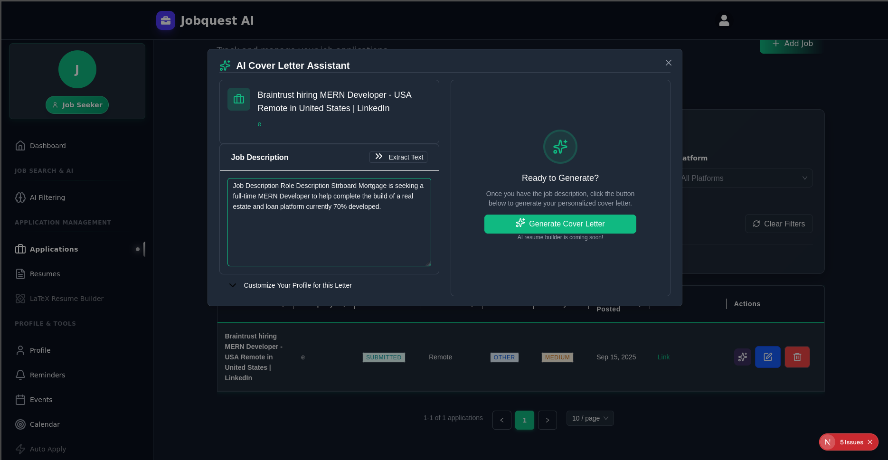
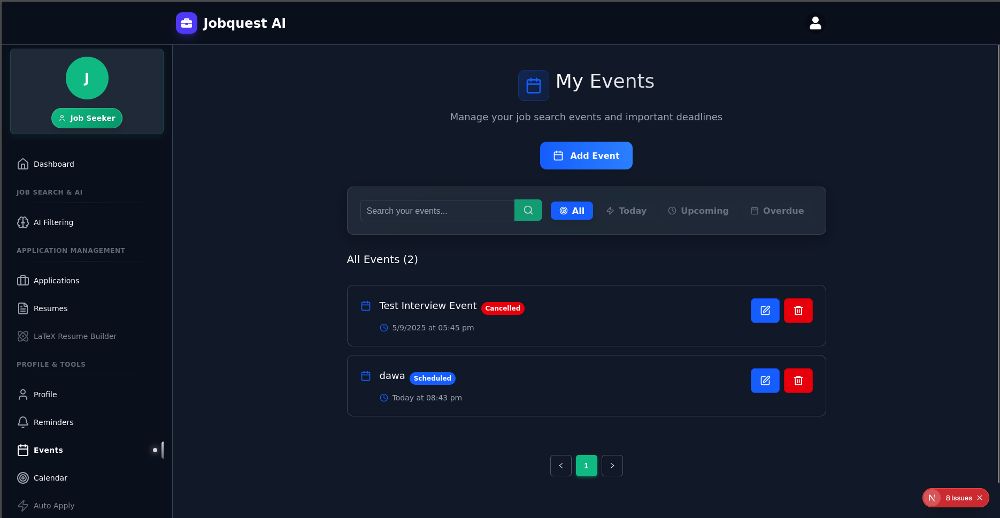
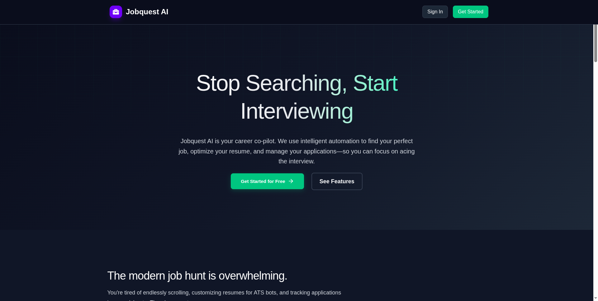
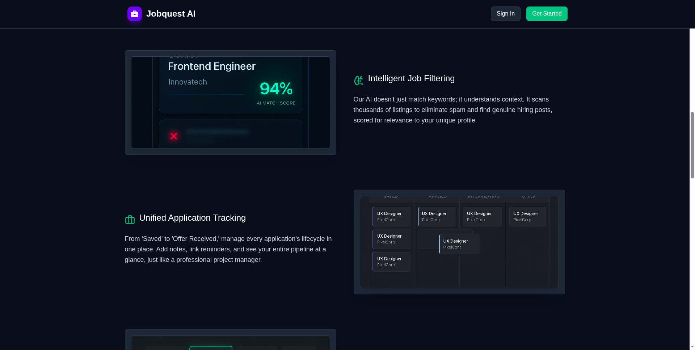

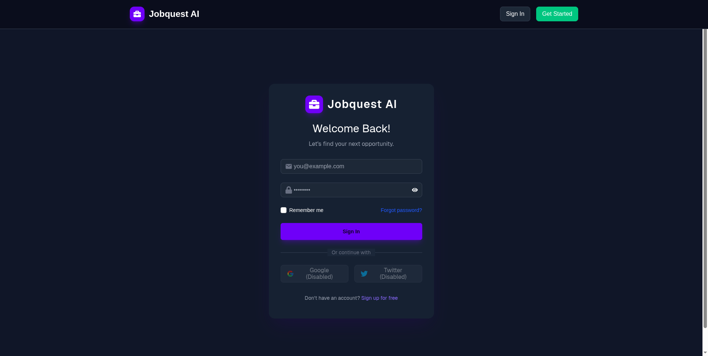

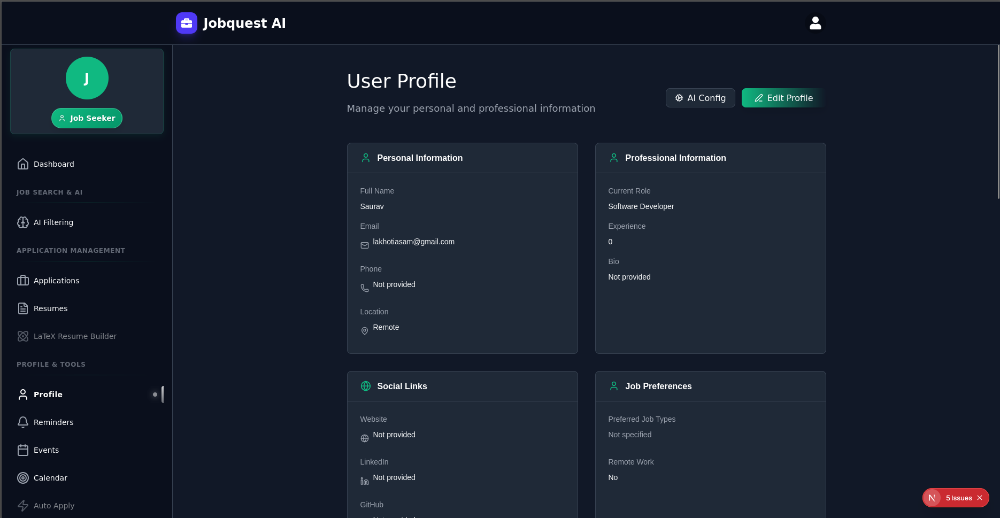
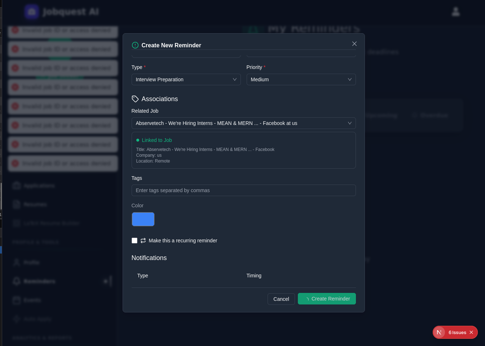
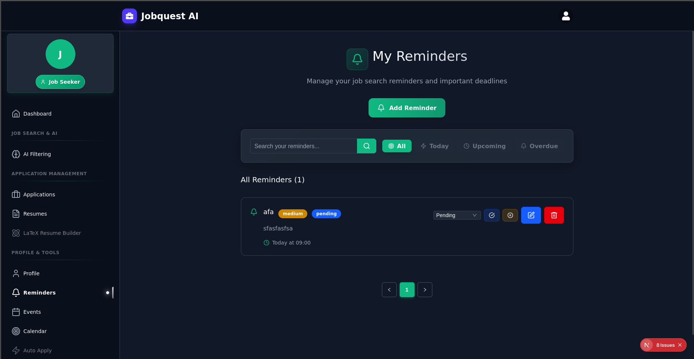
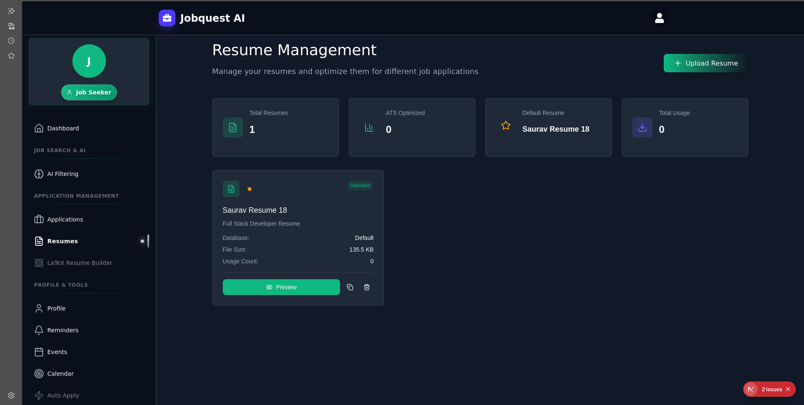


---

## 🚀 Getting Started

### Prerequisites

- Node.js (v18 or later recommended)
- MongoDB instance (local or cloud)
- AI provider setup (optional, see AI Configuration)

### Installation

```bash
git clone https://github.com/yourusername/jobquest-ai.git
cd jobquest-ai
npm install
cp .env.example .env.local
npm run dev
```

### Environment Variables

Create a `.env.local` file based on `.env.example` and configure the following:

```env
MONGODB_URI=your_mongodb_connection_string
NEXTAUTH_SECRET=your_nextauth_secret
NEXTAUTH_URL=http://localhost:3000

SEARCH_API_URLS=

AI_SERVER_URL=http://localhost:1234

CLOUDINARY_CLOUD_NAME=
CLOUDINARY_API_KEY=
CLOUDINARY_API_SECRET=
```

---

## 📂 Project Structure

```
jobquest-ai/
├── public/                 # Static assets (images, icons)
├── src/
│   ├── app/                # Next.js app routes and pages
│   ├── api/                # API route handlers
│   ├── components/         # React components
│   ├── lib/                # Utility libraries and services
│   ├── models/             # Database models
│   ├── services/           # Business logic and services
│   ├── hooks/              # React hooks
│   ├── types/              # TypeScript types
│   └── utils/              # Utility functions
├── .env.example            # Environment variables example
├── package.json            # Project metadata and dependencies
└── README.md               # This file
```

---

## 🛠 Usage

- Use the AI-powered job search page to find relevant job listings with intelligent filtering.
- Track jobs you are interested in and skip irrelevant ones.
- Manage your applications, resumes, and calendar reminders from the dashboard.
- Configure AI providers in the AI Config panel for customized filtering.

---

## 🔜 TODOs / Roadmap

| Task                                      | Status           | Priority |
|-------------------------------------------|------------------|----------|
| Auto apply on platforms like Naukri, Glassdoor | 🚧 In Progress   | High     |
| Integration with public job APIs and blogs | ⏳ Planned        | High     |
| Freelance gigs discovery                  | ⏳ Planned        | Medium   |
| Single-click ATS-friendly resume builder  | ⏳ Planned        | High     |
| Automated push/email/Telegram/in-app notifications | ⏳ Planned | Medium   |
| Telegram bot integration                 | ⏳ Planned        | Medium   |
| Google and Twitter OAuth                 | ⏳ Planned        | Medium   |
| Improve UI/UX and fix minor bugs          | ⏳ Planned        | High     |
| Fix broken links or webpages              | ⏳ Planned        | High     |
| Resend OTP feature                       | ⏳ Planned        | Medium   |
| Add dark mode                            | ⏳ Planned        | Low      |
| Integrate with Google Calendar            | 🚧 In Progress    | Medium   |
| Improve test coverage                    | ✅ Done           | Low      |

---

## 🤝 Contributing

We welcome contributions! Please follow these steps:

1. Fork the repository.
2. Create a new branch: `git checkout -b feature/your-feature-name`
3. Make your changes and commit: `git commit -m 'Add some feature'`
4. Push to your branch: `git push origin feature/your-feature-name`
5. Open a pull request describing your changes.

### Coding Standards

- Use **ESLint** and **Prettier** for code formatting.
- Follow **TypeScript** best practices.
- Write clear, concise commit messages.

### Testing

- Run tests with:

```bash
npm test
```

- Ensure all tests pass before submitting a PR.

---

## 📄 License

This project is licensed under the MIT License. See the [LICENSE](LICENSE) file for details.

---

## 📞 Contact

For questions or support, please open an issue or contact the maintainer.
